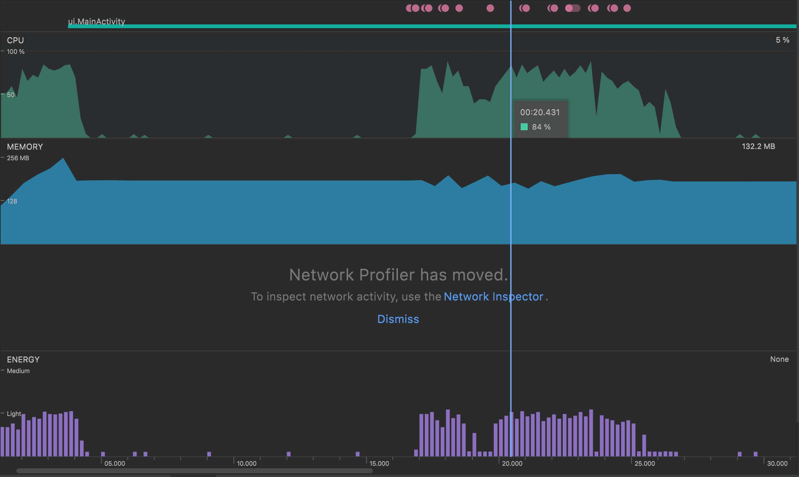

# MaraeMaps Beta

By Hugo Phibbs, Kavan Chay, Lucy Sladden and Harry Pirrit

## Improvements from the alpha

- Clicking on the Wiki entries now generates a screen displaying rich information on the specific
  marae. This includes a Street View and a Maps View
- Custom icons have been made for the launcher logo and wiki icon in the nav bar.
- Changing to dark mode on the mobile device now no longer prevents the user from reading any of the
  Wiki entries now - previously was unreadable due to colours.
- Small tweaks to improve ease of use
- Imbedded Google Maps and Street View of a Marae in the Marae Information page.
- App now has a different theme.

## Key features to still be implemented

- Clustering of Marae markers in the Maps view.
- Language switching between Maori and English.
- General aesthetic improvements.

---

## User testing

- We conducted brief user testing and have detailed points of feedback below:

#### Improving the Map View

- Users complained that the map view of Marae was quite overwhelming to interact with, given that
  there are 1000 marae markers across NZ. We are currently working towards clustering markers
  together, which spread apart upon zooming in, thus reducing visual overload.
- Another great idea was that the Maps view could start zoomed in over the region that a user is
  currently in (using a device's current location). For example, if you opened the app while in
  Dunedin, a zoomed in view of Otago along with its marae could be shown.

#### General Improvements

- For marae with empty data fields (eg Iwi or Hapu) a text shown be shown that this could not be
  found, instead of just being empty.
- Changing language in settings does not seem to do anything.

#### Bugs

- Users complained that zooming in on the Google Maps view while online had poor resolution. We
  think this is because the Google Maps data of NZ isn't actually saved locally.
- The app crashes when a user gets directions to a particular marae in Google Maps.

--- 

## Addressing CI feedback

### Code Coverage

- We have just 2 domain classes, that both have simple methods that are easy to test. Since these
  two classes are relatively short, there is not that much to test. Hence our code coverage is quite
  low at just 9%.
- We could increase our code coverage by adding automated UI testing, however we instead decided
  against this since this is a significant investment of time that could be used more effectively
  elsewhere.
- Hence our code coverage stands at just 8%.

### Code Quality

- We decided to ignore some distracting issues from the code quality reports, such as line index and
  private method documentation.
- Instead we addressed other issues, such as adding documentation where required.
- Thus, we were able to increase code quality from a B to A rating.

--- 

## Profiling our app

- Android Studio has a profiler that was used to profile CPU, memory and energy usage of app during
  use.

Our app has access to 100% CPU. Our main observations were recorded on an emulated Pixel 3a API 32 on a MacBook Pro M1 (ARM).

- Our CPU usage goes to an average of 63% on the launch of the Maps segment.
- Density of Markers also affects our CPU usage, when there are over 1000 markers on screen, usage  spikes around 80% (See included picture), whereas when there are only 2 markers, uses only 40%.
- Our CPU usage when clicking on a Marae also spikes to 5%.

- Memory usage rose to about 240MB during usage but never rose over that during use.
- Energy usage was consistently "light" during use, even when generating the Map.

- One thing to note is that our MapFragment re-opens on click, even when it is already open. This results in more CPU usage than is optimal.

- Our MaraeInfo screen contains both a Google Street View and a Google Map with a singular marker on it. These use 20% and 40% respectively in regards to CPU use.

- Our CPU usage goes to an average of 15% on the launch of our ‘Wiki’ segment.
- Our CPU usage goes to an average of 15% on the launch of our 'Settings' page.

- In Summary, using the profiler let us identify where most of our performance gains can be realised and we intend to use this information to optimise the app
  in several ways:
  - To reduce CPU usage, we plan to make the Map Fragment not be able to be opened when it already exists.
  - Another measure we will take is to implement clustering for the markering, meaning there cannot be more than approximately 20 markers being rendered on the user’s screen.
