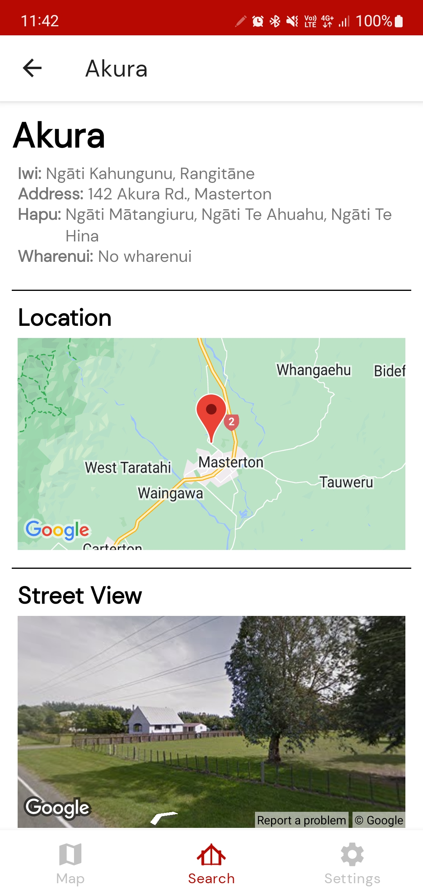

# COSC345 Final Report

## Addressing User Feedback

### Aesthetics
- In the final release, we sought out to create a unique feel and brand for our app. 
- This involved tweaking colours and fonts, adding formatting and making generally more professional.
- User testing of the new colour theme suggested that it was slick and modern looking.

### Improving the Maps View

## New Features

### Creating a marae information screen
- We created a information screen, providing users a more detailed and rich view of a chosen Marae.
- Includes more factual information than the Maps page, and adds inline Street and Map Views for a particular Marae.

- A user can then click on the map marker of the Marae, with a button popping up for directions via Google Maps 